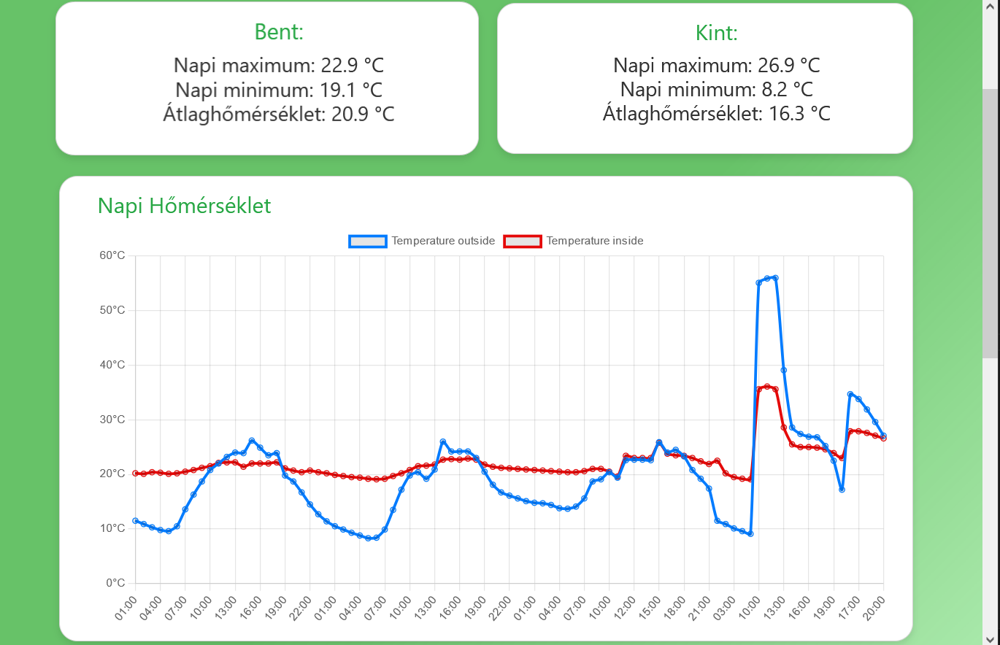

# 🌦️ Weather Station and Data Monitoring System

## 📑 Table of Contents
- [📖 Project Overview](#project-overview)
- [🌐 Live Website](#live-website)
- [✨ Features](#features)
- [🛠️ Technologies Used](#technologies-used)
- [⚙️ How It Works](#how-it-works)

---

## 📖 Project Overview

This project utilizes an **ESP32 microcontroller** connected to a home WiFi network to send environmental data (indoor and outdoor temperature, humidity, rain detection, and window status) to a custom website. The website stores the data in a **MySQL database**, providing **daily, weekly, and monthly** statistical comparisons of indoor and outdoor data. The ESP32 employs a **deep sleep mode** for optimized power consumption, sending data every 10 minutes.

---

## 🌐 Live Website

The project website is published and accessible at the following URL:  
👉 [https://gardenmonitor.eu](https://gardenmonitor.eu)

---

## ✨ Features

- **ESP32 Functionalities:**
  - 🕒 Periodic data collection every 10 minutes.
  - 🔋 Low-power deep sleep functionality.
  - 🌡️ Sensors for temperature, humidity, rain, and window status.

- **Website Functionalities:**
  - 🔒 Securely receives data from the ESP32.
  - 💾 Saves data in a MySQL database.
  - 📈 Displays:
    - Daily, weekly, and monthly statistics.
    - Comparisons between indoor and outdoor conditions.
  - 🖥️ User-friendly, responsive web interface.

---

## 🛠️ Technologies Used

### ESP32:
- Arduino IDE
- Deep sleep optimization
- WiFi connectivity

### Website:
- **Frontend:**
  - HTML, CSS, JavaScript
- **Backend:**
  - PHP
  - MySQL Database

---

## ⚙️ How It Works

1. ** Data Collection:**
   - ESP32 collects temperature, humidity, rain status, and window status.
2. ** Data Transmission:**
   - The data is sent to a website endpoint every 10 minutes.
3. ** Deep Sleep Mode:**
   - ESP32 enters deep sleep to save power.
4. ** Data Storage:**
   - The website receives and stores data in a MySQL database.
5. ** Data Analysis & Display:**
   - The website calculates and displays statistics in daily, weekly, and monthly formats.

---

## 📸 Website Demo

  
*Dashboard showing temperature and humidity comparisons.*

